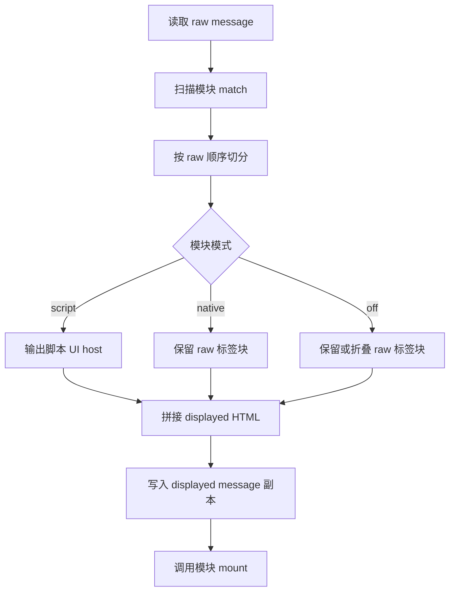
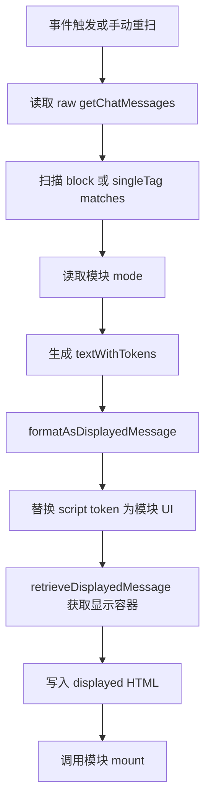

# 故事 UI 模块显示引擎互斥重构方案

## 背景

当前测试版位于 [`public/story_regex_ui_test`](../public/story_regex_ui_test)。用户已将测试版退回到较稳定的版本。

当前稳定版核心特征：

- [`index.js`](../public/story_regex_ui_test/index.js) 会读取 raw message。
- 模块通过 `block` 或 `singleTag` 声明标签。
- 核心扫描 raw 后，在 displayed DOM 中尝试定位模块原文并替换为脚本 UI。
- 若定位失败，会 fallback append 到楼层显示容器末尾。
- 该版本不是完整整楼重建，也不是之前的 hidden source 外挂版本，而是“原生正则先渲染 + 脚本尝试替换原文”的混合稳定版。

用户明确的新需求：

- 需要脚本美化无限趋近正则显示。
- 模块化：每个模块声明自身标签和 CSS。
- 核心负责识别标签、调用模块、挂载美化脚本、隐藏对应原文。
- 不写回 raw message，不能影响后续正则和变量处理读取 raw。
- 管理面板可以热插拔模块。
- 当前核心问题是：脚本美化和酒馆原生正则显示互斥。原生正则显示时，脚本不显示或暴露原文；脚本显示时，原生正则不显示。

---

## COAT 决策记录

### 1. 联想扩展

#### 技术上下文

- 酒馆助手可用能力包括读取 raw、读取 displayed、刷新楼层、格式化 displayed message、脚本按钮、管理面板。
- raw message 是后续正则、AI 过滤、变量处理的真实输入，不能写回或删除。
- displayed message 是当前网页显示副本，可以由脚本改写。
- 酒馆原生正则和脚本 UI 目前争夺同一段模块标签内容。

#### 功能需求

核心目标不是让两个渲染器同时作用于同一模块，而是让同一模块在同一时刻只有一个显示来源：

- `script` 模式：脚本 UI 显示，原 raw 标签块不显示。
- `native` 模式：酒馆原生正则显示，脚本 UI 不显示。
- `off` 模式：模块关闭，保留原文或按配置折叠。

#### 实现约束

- 只修改测试版 [`public/story_regex_ui_test`](../public/story_regex_ui_test)。
- 不修改正式版 [`public/story_regex_ui_prod`](../public/story_regex_ui_prod)。
- 不引入外部依赖。
- 不做跨大范围文本锚点猜测作为主流程。
- 保留最近楼层扫描限制，避免全历史重绘。

---

### 2. 候选方案

#### 方案 A：继续显示层锚点替换

实现路径：

- 保留当前稳定版逻辑。
- 为模块补充更多显示层锚点和边界规则。
- 根据原生正则输出文本定位并替换。

风险：

- 原生正则输出不是 raw 标签结构，边界不稳定。
- BP、world-log、variable-update 已出现半截残留。
- 会继续变成补丁堆叠。

结论：不推荐。

#### 方案 B：退回旧整楼注入

实现路径：

- 按 raw message 切分普通正文和模块块。
- 模块块直接替换为脚本 UI。
- 普通正文调用酒馆助手格式化。
- 写回 displayed message 副本。

优点：

- 脚本 UI 显示时，raw 标签块不会暴露。
- 模块顺序稳定。

风险：

- 原生正则无法再显示对应模块。
- 原生显示和脚本显示互斥问题仍然存在，只是由脚本单方面覆盖。

结论：可作为基线，但需要增加显示引擎模式。

#### 方案 C：模块显示引擎互斥模式

实现路径：

- 保留 raw 扫描作为唯一真相。
- 每个模块维护显示模式：`script`、`native`、`off`。
- 渲染时从 raw 切分消息：
  - `script`：输出脚本 UI，不输出 raw 标签块。
  - `native`：输出 raw 标签块，交给酒馆原生正则或格式化链路处理，不挂脚本 UI。
  - `off`：保留原文或折叠。
- 管理面板支持切换每个模块的显示模式。

优点：

- 从源头避免两个渲染器抢同一个模块。
- 不再依赖不稳定 displayed DOM 边界猜测。
- raw message 不破坏。
- 可以按模块选择原生显示或脚本显示。

结论：推荐。

---

### 3. 测试与打分

| 方案 | 架构合理性 | 实现复杂度 | 可维护性 | 性能 | 兼容性 | 错误处理 | 测试可行性 | 总评 |
|---|---:|---:|---:|---:|---:|---:|---:|---|
| A 显示层锚点替换 | 2 | 2 | 2 | 4 | 2 | 3 | 2 | 不推荐 |
| B 旧整楼注入 | 4 | 3 | 4 | 3 | 2 | 4 | 4 | 可作为基线 |
| C 显示引擎互斥 | 5 | 3 | 5 | 3 | 4 | 4 | 5 | 推荐 |

约束检查：

- 符合酒馆插件开发规范：C 通过。
- 不引入外部高危依赖：C 通过。
- 内存使用合理：C 通过，继续限制最近楼层。
- 无明显 XSS 风险：C 通过，模块继续 escape。
- 支持浏览器环境：C 通过。
- 代码体积合理：C 通过。
- raw 不破坏：C 通过。
- 原生和脚本互斥：C 通过。

---

### 4. 回溯

回溯触发项：

- 当前方案 A 已经被真实浏览器诊断证明不稳定。
- 方案 B 会重新回到“脚本覆盖原生正则”的旧冲突。

回溯结论：

- 不继续锚点小修。
- 不直接退回无模式的整楼注入。
- 采用方案 C：以 raw 切分渲染为基础，加入模块显示引擎互斥模式。

---

## 最终技术方案

### 模块显示模式

新增模块模式：

```text
script: 脚本显示。模块 raw 标签块替换为脚本 UI。
native: 原生显示。模块 raw 标签块保留，脚本 UI 不显示。
off: 关闭。模块不由脚本处理，按配置保留或折叠。
```

建议存储键：

```text
jjks_story_ui_module_modes
```

建议数据结构：

```json
{
  "bp-panel": "script",
  "world-log": "script",
  "variable-update": "script",
  "story-engine": "script",
  "mvu-status": "script"
}
```

### 渲染流程



### 管理面板

每个模块从二态按钮升级为三态：

- 脚本显示
- 原生显示
- 关闭

切换后刷新最近窗口，并清理签名缓存。

### 诊断字段

建议诊断面板新增：

- `模块显示模式`
- `最近楼层模块模式`
- `scriptMounted`
- `nativePassedThrough`
- `offSkipped`
- `renderFallback`

---

## 当前问题测试方案

### 测试目标

验证当前稳定版的互斥问题，确认以下事实：

1. raw 中存在模块标签。
2. 模块已注册并启用。
3. 脚本尝试挂载模块 UI。
4. 如果原生正则已经把 raw 标签转换为显示文本，脚本无法稳定定位原 raw 标签，因此 fallback append。
5. 结果表现为脚本 UI 与原生显示互斥或重复/残留。

### 控制台诊断脚本

当前 Architect 模式只能落盘 Markdown 文档，不能创建 `.js` 文件。以下脚本作为可复制的控制台测试脚本记录在本文档中；如需单独生成 `tmp/story-ui-mutual-exclusion-diagnose.js`，切换到 Code 模式后再落盘。

```javascript
(() => {
  const safe = fn => {
    try {
      return fn();
    } catch (error) {
      return `__ERROR__ ${error?.message || error}`;
    }
  };

  const host = (() => {
    const candidates = [window];
    safe(() => {
      if (window.parent && !candidates.includes(window.parent)) candidates.push(window.parent);
    });
    safe(() => {
      if (window.top && !candidates.includes(window.top)) candidates.push(window.top);
    });
    return (
      candidates
        .map(win => ({
          win,
          score: safe(
            () =>
              (win.JJKSStoryUiManager?.test ? 40 : 0) +
              (win.StoryRegexUI ? 30 : 0) +
              (win.TavernHelper ? 20 : 0) +
              (win.document?.querySelector?.('.mes[mesid]') ? 10 : 0),
          ),
        }))
        .filter(item => typeof item.score === 'number')
        .sort((a, b) => b.score - a.score)[0]?.win || window
    );
  })();

  const doc = host.document || document;
  const ui = host.StoryRegexUI || window.StoryRegexUI || null;
  const manager = host.JJKSStoryUiManager?.test || window.JJKSStoryUiManager?.test || null;
  const diagnosis = safe(() => manager?.diagnose?.()) || null;

  const getRaw = messageId =>
    safe(() => {
      const fn =
        host.TavernHelper?.getChatMessages ||
        host.getChatMessages ||
        window.TavernHelper?.getChatMessages ||
        window.getChatMessages;
      return fn?.(messageId)?.[0]?.message || '';
    }) || '';

  const getDisplayed = messageId =>
    safe(() => {
      const fn =
        host.TavernHelper?.retrieveDisplayedMessage ||
        host.retrieveDisplayedMessage ||
        window.TavernHelper?.retrieveDisplayedMessage ||
        window.retrieveDisplayedMessage;
      return fn?.(messageId)?.[0] || doc.querySelector(`.mes[mesid="${messageId}"] .mes_text, .mes[mesid="${messageId}"] .custom-mes_text`);
    });

  const textOf = node => String(node?.innerText || node?.textContent || '').replace(/\s+/g, ' ').trim();
  const has = (pattern, value) => pattern.test(String(value || ''));

  const moduleMarkers = {
    'story-engine': {
      raw: /<story_driver>/i,
      native: /STORY ENGINE|━━\s*1[.．、]\s*全域锚定|全域锚定/i,
    },
    'bp-panel': {
      raw: /<bp_panel>/i,
      native: /BP战力雷达|【BP战力雷达】|扫描状态|已扫描目标/i,
    },
    'world-log': {
      raw: /<wlog\b/i,
      native: /世界运行报告|【世界主线】|Time passed:/i,
    },
    'variable-update': {
      raw: /<UpdateVariable>|<JSONPatch>/i,
      native: /变量更新|"op"\s*:|JSONPatch/i,
    },
    'mvu-status': {
      raw: /<StatusPlaceHolderImpl\/>/i,
      native: /世界状态|GLOBAL ANCHOR|个人状态档案/i,
    },
  };

  const scriptUrls = Array.from(doc.scripts || [])
    .map(script => script.src || script.dataset?.storyUiScript || '')
    .filter(url => /story_regex_ui_test/.test(url));
  const styleUrls = Array.from(doc.querySelectorAll('link[rel="stylesheet"]') || [])
    .map(link => link.href || link.dataset?.storyUiCss || '')
    .filter(url => /story_regex_ui_test/.test(url));

  const ids = Array.from(doc.querySelectorAll('.mes[mesid]'))
    .map(node => Number(node.getAttribute('mesid')))
    .filter(Number.isFinite)
    .slice(-8);

  const messages = ids.map(messageId => {
    const root = doc.querySelector(`.mes[mesid="${messageId}"]`);
    const raw = String(getRaw(messageId) || '');
    const displayed = getDisplayed(messageId);
    const displayedText = textOf(displayed);
    const mounts = Array.from(root?.querySelectorAll?.('[data-story-ui-raw-mount="true"]') || []);
    const modules = Object.fromEntries(
      Object.entries(moduleMarkers).map(([moduleId, marker]) => {
        const scriptMounts = mounts.filter(node => node.getAttribute('data-story-ui-module') === moduleId);
        const rawPresent = has(marker.raw, raw);
        const nativePresent = has(marker.native, displayedText);
        const scriptPresent = scriptMounts.length > 0;
        let status = 'absent';
        if (rawPresent && nativePresent && scriptPresent) status = 'duplicate-or-conflict';
        else if (rawPresent && nativePresent && !scriptPresent) status = 'native-only';
        else if (rawPresent && !nativePresent && scriptPresent) status = 'script-only';
        else if (rawPresent && !nativePresent && !scriptPresent) status = 'raw-present-but-not-displayed-by-native-or-script';
        return [
          moduleId,
          {
            rawPresent,
            nativePresent,
            scriptPresent,
            scriptMountCount: scriptMounts.length,
            status,
            scriptTextHead: scriptMounts.map(node => textOf(node).slice(0, 180)),
          },
        ];
      }),
    );
    return {
      messageId,
      rawLength: raw.length,
      displayedLength: displayedText.length,
      mountCount: mounts.length,
      mountedModules: mounts.map(node => node.getAttribute('data-story-ui-module')),
      modules,
      displayedHead: displayedText.slice(0, 300),
      displayedTail: displayedText.slice(-300),
    };
  });

  const result = {
    purpose: 'diagnose current stable test build mutual exclusion between native regex display and script UI display',
    location: String(host.location?.href || location.href),
    managerDiagnosis: diagnosis,
    storyRegexUiReady: Boolean(ui),
    scannerReady: Boolean(ui?.scanner),
    registryModules:
      ui?.registry?.list?.({ includeDisabled: true })?.map(module => ({
        id: module.id,
        version: module.version,
        enabled: module.enabled !== false,
        priority: module.priority,
      })) || [],
    scriptUrls,
    styleUrls,
    messages,
  };

  console.log('[JJKS Story UI Mutual Exclusion Diagnose]', result);
  console.log(JSON.stringify(result, null, 2));
  return result;
})();
```

### 预期结论

如果当前稳定版确实存在互斥问题，诊断应看到：

- raw marker 为 true。
- 原生显示块存在。
- 脚本 UI 要么不存在，要么 fallback append。
- 如果脚本 UI 存在，对应原生显示没有被稳定隐藏。

### 2026-05-14 浏览器诊断结果记录

用户在酒馆浏览器 Console 执行本文档诊断脚本后，返回结果确认当前稳定版互斥问题不是假设，而是已复现事实。

关键事实：

- 测试版资源已加载，入口版本为 `test`。
- 扫描器、注册表、管理面板均就绪。
- 已注册模块共 8 个，其中 `variable-update`、`bp-panel`、`story-engine`、`world-log`、`relation-status`、`mvu-status` 启用，`bp-panel-newvars`、`mvu-status-newvars` 关闭。
- 在 message `1856`、`1858`、`1860` 中，raw message 存在模块标签，且 displayed message 中同时存在原生正则显示和脚本 UI 挂载。
- message `1856` 中 `bp-panel`、`world-log`、`variable-update`、`mvu-status` 均为 `duplicate-or-conflict`。
- message `1860` 中 `story-engine`、`bp-panel`、`world-log`、`variable-update`、`mvu-status` 全部为 `duplicate-or-conflict`。
- displayed 内容头部出现 `<!DOCTYPE html>`、`<html>`、`<head>` 等完整 HTML 文档片段，说明某些原生正则美化结果作为整段 HTML 文本进入了 displayed message，与脚本 UI 同时存在。
- 当前稳定版的脚本挂载数在相关楼层为 4 或 5，但原生正则显示仍存在，因此当前主流程没有做到“脚本显示时原生不显示”。

归因更新：

- 当前稳定版不是单纯“脚本不显示”，而是脚本与原生正则同时显示同一模块。
- 原因是 [`mountModulesForMessage()`](../public/story_regex_ui_test/index.js:721) 在原生正则渲染后的 displayed DOM 中执行替换；当 [`replaceRawTextWithMountHost()`](../public/story_regex_ui_test/index.js:693) 无法在已变形的 displayed DOM 中找到 raw 标签原文时，会 fallback append 脚本 UI。
- 因为原生正则已经将 raw 标签块转为完整 HTML 文本或可见摘要，脚本无法稳定按 raw 原文替换，最终形成 `duplicate-or-conflict`。
- 这进一步排除“继续补锚点”路线，支持方案 C：必须在 raw 切分阶段决定每个模块由 `script`、`native` 或 `off` 哪个显示引擎处理。

---

## 三态互斥可行性复核

### 当前文件结构复核

当前测试版 [`public/story_regex_ui_test`](../public/story_regex_ui_test) 结构完整，已具备实现三态互斥所需的基础：

```text
public/story_regex_ui_test
├── index.js
├── loader.js
├── shared.css
├── core
│   ├── dom.js
│   ├── registry.js
│   ├── scanner.js
│   └── theme.js
└── modules
    ├── bp-panel
    ├── bp-panel-newvars
    ├── manager-ui
    ├── mvu-status
    ├── mvu-status-newvars
    ├── relation-status
    ├── story-engine
    ├── variable-update
    └── world-log
```

已确认的关键代码位置：

- [`core/registry.js`](../public/story_regex_ui_test/core/registry.js:4) 目前只有二态 enabled 存储，键为 `jjks_story_ui_module_enabled_state`。
- [`index.js`](../public/story_regex_ui_test/index.js:548) 已存在 `renderMessageHtmlByModules()`，这是 raw 切分整楼渲染能力，可以作为三态互斥的基础，而不是继续使用 displayed DOM 替换。
- [`index.js`](../public/story_regex_ui_test/index.js:721) 当前主流程 `mountModulesForMessage()` 使用 displayed DOM 替换。
- [`index.js`](../public/story_regex_ui_test/index.js:754) 当前冲突点是 `replaceRawTextWithMountHost(textElement, match.fullMatch, mountHost)`：原生正则已经变形 displayed DOM 后，raw fullMatch 经常找不到，于是 fallback append。
- [`index.js`](../public/story_regex_ui_test/index.js:1168) 管理面板模块列表目前是二态“开启/关闭”。
- [`index.js`](../public/story_regex_ui_test/index.js:1217) `toggleManagerModule()` 当前只切换 registry enabled。
- [`modules/manager-ui/index.js`](../public/story_regex_ui_test/modules/manager-ui/index.js:50) 管理面板已有模块状态区，可以扩展三态按钮。
- [`modules/manager-ui/style.css`](../public/story_regex_ui_test/modules/manager-ui/style.css:1) 管理面板已有完整样式体系，可以补充三态按钮样式。
- 各模块均已通过 `block` 或 `singleTag` 注册：
  - [`variable-update/index.js`](../public/story_regex_ui_test/modules/variable-update/index.js:92)
  - [`bp-panel/index.js`](../public/story_regex_ui_test/modules/bp-panel/index.js:242)
  - [`bp-panel-newvars/index.js`](../public/story_regex_ui_test/modules/bp-panel-newvars/index.js:290)
  - [`story-engine/index.js`](../public/story_regex_ui_test/modules/story-engine/index.js:410)
  - [`world-log/index.js`](../public/story_regex_ui_test/modules/world-log/index.js:150)
  - [`relation-status/index.js`](../public/story_regex_ui_test/modules/relation-status/index.js:180)
  - [`mvu-status/index.js`](../public/story_regex_ui_test/modules/mvu-status/index.js:622)
  - [`mvu-status-newvars/index.js`](../public/story_regex_ui_test/modules/mvu-status-newvars/index.js:662)

### 三态互斥是否能够解决

结论：可以解决当前诊断中的 `duplicate-or-conflict`，但前提是三态互斥必须成为渲染主流程，而不是在当前 displayed DOM 替换流程外再套一层状态。

原因：

- 当前问题的直接原因是同一模块同时满足 `rawPresent=true`、`nativePresent=true`、`scriptPresent=true`。
- 三态互斥的核心不是增加 UI 按钮，而是在 raw 切分渲染阶段禁止同一模块进入两个显示引擎。
- 如果模块处于 `script`：核心从 raw 中切掉该模块 fullMatch，只输出脚本 UI token，因此 displayed 副本里不会再有该模块 raw 标签块供原生正则显示。
- 如果模块处于 `native`：核心保留该模块 raw 标签块，且不创建脚本 UI mount host，因此 `scriptPresent=false`。
- 如果模块处于 `off`：核心不为该模块创建脚本 UI；是否保留 raw 或折叠由配置决定。

因此，在正确实现后，同一模块只可能出现以下状态之一：

| 模式 | rawPresent | nativePresent | scriptPresent | 是否冲突 |
|---|---|---|---|---|
| script | true | false 或非模块原生残留 | true | 否 |
| native | true | true | false | 否 |
| off | true | 取决于保留策略 | false | 否 |

需要特别说明：`rawPresent` 指 raw message 里仍有标签，这是必须保留的，不是问题。问题只在 displayed message 中 `nativePresent` 和 `scriptPresent` 同时为 true。

### 三态互斥不能解决的事项

三态互斥不是万能方案，它不解决以下问题：

- 如果 `script` 模式下普通正文的酒馆格式化链路把某些非模块 HTML 文本异常展开，仍需要单独排查 `formatAsDisplayedMessage()` 的输入。
- 如果某个模块的脚本 UI 视觉与原生正则视觉不一致，三态只能让用户选择显示源，不能自动让脚本 UI 完全等同原生正则。
- 如果用户同时启用测试版和正式版入口，仍会产生跨环境重复挂载，需依赖当前另一个环境检测警告。
- 如果 `native` 模式要求“原生正则运行后脚本再插入辅助 UI”，那会重新变成双渲染器共存，不属于本方案。

### 当前结构能否实现

结论：能够实现，且不需要修改模块视觉代码作为第一阶段。

最小必要改动范围：

1. [`core/registry.js`](../public/story_regex_ui_test/core/registry.js:4)
   - 新增 `jjks_story_ui_module_modes` 存储。
   - 新增 `getMode(moduleId)`、`setMode(moduleId, mode)`、`isScriptMode(moduleId)`。
   - 保留旧 enabled 状态兼容：`enabled=false` 可映射为 `off`；无 mode 时默认 `script`。

2. [`index.js`](../public/story_regex_ui_test/index.js:548)
   - 将 `renderMessageHtmlByModules()` 改为真正主流程。
   - 根据模块 mode 决定：
     - `script`：输出 token，最终替换为 `<section data-story-ui-raw-mount>`。
     - `native`：保留 `match.fullMatch` 到 `textWithPlaceholders`，不创建 replacement。
     - `off`：保留或折叠 `match.fullMatch`，不创建 replacement。
   - [`mountModulesForMessage()`](../public/story_regex_ui_test/index.js:721) 不再使用 `replaceRawTextWithMountHost()` 作为主流程，而是把 `textElement.innerHTML` 设置为 raw 切分后的 HTML。
   - `replaceRawTextWithMountHost()` 可删除或降级为历史 fallback。

3. [`index.js`](../public/story_regex_ui_test/index.js:1168)
   - 管理面板模块列表显示三态按钮，而不是单个开启/关闭按钮。
   - 三态切换后清理 `messageSignatures` 与 `mountedModulesByMessage`，重新渲染最近窗口。

4. [`modules/manager-ui/index.js`](../public/story_regex_ui_test/modules/manager-ui/index.js:50)
   - 模块状态区结构可以不大改，仅由 `index.js` 注入三态按钮 HTML。

5. [`modules/manager-ui/style.css`](../public/story_regex_ui_test/modules/manager-ui/style.css:1)
   - 补充 `.jjks-manager-mode-group`、`.jjks-manager-mode-button` 等样式。

6. [`loader.js`](../public/story_regex_ui_test/loader.js:27)
   - 更新版本号用于缓存失效。

### 必须避免的错误实现

以下实现不能解决问题：

- 只在管理面板增加三态按钮，但 `mountModulesForMessage()` 仍继续对 displayed DOM 执行 `replaceRawTextWithMountHost()`。
- `script` 模式下仍先让原生正则渲染，再尝试隐藏原生块。
- `native` 模式下仍创建脚本 UI，只是用 CSS 隐藏。
- 继续通过增加 start/end anchor 修复 displayed DOM 边界。

### 酒馆助手方法复核

已搜索 [`@types`](../@types) 与示例目录，和当前任务直接相关且可用的方法如下。

#### `getChatMessages()`

定义位置：[`chat_message.d.ts`](../@types/function/chat_message.d.ts:56)。

用途：读取聊天消息 raw 数据。当前测试版 [`readRawMessage()`](../public/story_regex_ui_test/index.js:343) 已使用该类能力读取 raw message。

结论：继续作为 raw 扫描唯一来源。不能用 `setChatMessages()` 或写回 raw，因为需求明确不破坏后续正则、变量处理和 AI 过滤读取的原始消息。

#### `retrieveDisplayedMessage()`

定义位置：[`displayed_message.d.ts`](../@types/function/displayed_message.d.ts:21)。

文档明确说明：

- 该函数返回消息内容 JQuery 实例。
- 可以 `.text()`、`.append()` 或设置内容。
- 这样的修改只影响本次显示，不会保存到消息文件。

用途：获取并改写当前 displayed message 容器。当前测试版通过 [`getDisplayedMessageElement()`](../public/story_regex_ui_test/index.js:313) 和 [`getDisplayedMessageTextElement()`](../public/story_regex_ui_test/index.js:376) 间接获取显示容器。

结论：这是实施三态互斥的关键方法。计划应修正为：优先使用 `retrieveDisplayedMessage(messageId)` 获取 `.mes_text` / `.custom-mes_text`，然后在脚本渲染模式下设置该 displayed 容器的 HTML 副本。此操作符合“只改当前网页显示副本，不写 raw”。

#### `formatAsDisplayedMessage()`

定义位置：[`displayed_message.d.ts`](../@types/function/displayed_message.d.ts:46)。

文档说明该方法会：

1. 替换酒馆宏。
2. 对字符串应用对应的酒馆正则。
3. 调整为 HTML 显示格式。

这点非常关键：如果在 `script` 模式中把“包含模块 raw 标签的整段文本”直接传入 `formatAsDisplayedMessage()`，酒馆原生正则仍会对模块标签生效，导致重复显示。因此三态互斥必须先按 raw match 切分：

- `script` 模块：把 raw fullMatch 替换为唯一 token，再调用 `formatAsDisplayedMessage()`，最后将 token 替换为脚本 UI HTML。
- `native` 模块：保留 raw fullMatch，让 `formatAsDisplayedMessage()` 正常对该模块应用原生正则，且不生成脚本 UI。
- `off` 模块：保留 raw fullMatch 或替换为折叠 token，且不生成脚本 UI。

结论：`formatAsDisplayedMessage()` 可以使用，但必须以 token 隔离方式使用；不能对含有 script 模式模块 raw 标签的文本直接格式化。

#### `refreshOneMessage()`

定义位置：[`displayed_message.d.ts`](../@types/function/displayed_message.d.ts:70)。

用途：刷新或替换单个楼层的显示，不写入消息文件。当前测试版已有 [`refreshRenderedMessagesForNativeRender()`](../public/story_regex_ui_test/index.js:1310)，资源重载时会先刷新原生楼层显示。

结论：保留为受控入口，用于：

- 手动重扫前恢复酒馆原生 displayed baseline。
- 资源重载后恢复近期楼层原生显示，再让脚本按 mode 重建显示副本。
- 切换到 `native` 模式时，可先 `refreshOneMessage(messageId)` 再跳过脚本 UI 注入，确保原生显示干净。

禁止用法：普通渲染事件中无条件调用，避免 refresh → render event → queueScan → refresh 循环。

#### `formatAsTavernRegexedString()`

搜索位置：[`tavern_regex.d.ts`](../@types/function/tavern_regex.d.ts:19)。

用途：可对文本应用酒馆正则。当前计划不优先采用它，因为 `formatAsDisplayedMessage()` 已包含宏替换、正则应用和 HTML 显示格式化，接口更贴合本任务 displayed message 重建。

结论：作为后备研究对象，不纳入第一阶段实现。

### 基于酒馆助手方法的计划修正

原计划“raw 切分后写入 displayed message 副本”是正确的，但需要更明确地绑定酒馆助手方法：

1. 读取 raw：使用 `getChatMessages(messageId)[0].message`。
2. 获取 displayed 容器：优先使用 `retrieveDisplayedMessage(messageId)`，失败再 fallback 到 DOM 查询。
3. 恢复原生 baseline：手动重扫、资源重载、模式切换到 `native` 前，受控调用 `refreshOneMessage(messageId)`。
4. 格式化文本：使用 `formatAsDisplayedMessage(textWithTokens, { message_id: messageId })`。
5. 注入脚本 UI：在格式化后的 HTML 中替换唯一 token 为 `<section data-story-ui-raw-mount>`，然后写入 displayed 容器。
6. 模块挂载：写入后再对 `[data-story-ui-raw-mount]` 调用模块 `mount()`。

修正后的主流程：



### 酒馆助手方法对三态互斥的影响

搜索结果进一步确认三态互斥可行，并且比 displayed DOM 替换更符合酒馆助手接口设计：

- `retrieveDisplayedMessage()` 明确允许只修改网页显示副本。
- `formatAsDisplayedMessage()` 明确会应用酒馆正则，因此必须用 token 隔离 script 模式模块。
- `refreshOneMessage()` 可以作为恢复原生显示的受控方法。
- 不需要写 raw message，不需要替换角色卡正则，也不需要修改酒馆正则配置。

因此，最终推荐方案从“泛称 raw 切分整楼重建”修正为：

> 基于酒馆助手 displayed message API 的 raw-token 三态互斥渲染器。

### 最终判断

三态互斥能够解决当前已诊断的 `duplicate-or-conflict`，当前 [`public/story_regex_ui_test`](../public/story_regex_ui_test) 文件结构也能够实现。正确实施方式是：以 [`renderMessageHtmlByModules()`](../public/story_regex_ui_test/index.js:581) 为主流程，按 raw match 和模块 mode 生成 displayed 副本；使用酒馆助手 `retrieveDisplayedMessage()` 获取显示容器，使用 `formatAsDisplayedMessage()` 处理 token 化文本，必要时受控调用 `refreshOneMessage()` 恢复原生 baseline；禁用当前 displayed DOM 替换主流程。

### 2026-05-14 原生模式反馈后的方案复核

用户最新反馈显示：切换为 `native` 模式并点击重载资源后，酒馆原生美化正则出现，但脚本美化不显示。结合当前实现复核，这一现象符合三态互斥设计：

- [`renderMessageHtmlByModules()`](../public/story_regex_ui_test/index.js:581) 过滤出 `script` 模式模块，只为这些模块生成 token 与 `[data-story-ui-raw-mount]`。
- [`mountModulesForMessage()`](../public/story_regex_ui_test/index.js:758) 若没有 `script` 模式 match，会执行清理并返回，不再挂载脚本 UI。
- [`diagnose()`](../public/story_regex_ui_test/index.js:929) 已能输出 `模块显示模式`、`最近跳过原生或关闭楼层` 与 `最近脚本重写楼层`，可用于确认 native-only 是否为设计内跳过。

因此需要区分三个层级：

```text
A. script raw-token 接管：脚本替换 raw，原生同模块正则不应显示。
B. native pass-through：原生正则显示，脚本同模块 UI 不应显示。
C. after-native overlay：原生正则先显示，脚本再在原生 DOM 上定位、替换或增强。这不是当前三态已经实现的内容。
```

本轮新增浏览器诊断脚本 [`tmp/story-ui-after-native-diagnose.js`](../tmp/story-ui-after-native-diagnose.js)，用于采集每个模块 mode、raw 标签存在性、原生正则可见结果、脚本 mount、native/off 跳过证据、manager diagnosis 扫描统计，以及 `nativeEvidenceNodes` 中原生正则结果的 DOM 类名、标题文本、父节点与兄弟节点结构。

浏览器回传 JSON 后已确认：

- 测试版资源加载正常，版本为 `test-native-skip-20260514`；`StoryRegexUI`、scanner、manager 均就绪。
- 主模块全部为 `native`，新变量 BP/MVU 为 `off`；`故事UI节点数=0`、各相关楼层 `mountCount=0`、`最近扫描包含脚本接管模块=false`、`最近脚本重写楼层=[]`。
- manager diagnosis 的 `最近跳过原生或关闭楼层` 包含 1860、1862、1864，说明 [`mountModulesForMessage()`](../public/story_regex_ui_test/index.js:758) 确实按设计跳过 native/off-only 楼层。
- message 1860、1862、1864 中，`story-engine`、`bp-panel`、`world-log`、`variable-update` 多数为 `rawPresent=true/nativePresent=true/scriptPresent=false/observedClass=native-only/modeMatchesImplementation=true`。
- 没有出现 `nativePresent=true/scriptPresent=true`，因此没有证据表明脚本挂载丢失；当前反馈是三态互斥设计内结果。

最终诊断：当前问题不是实现 bug，而是需求模式缺失。若目标是“原生正则先显示，脚本再显示/替换/增强”，必须新增 `after-native`/`overlay`/`enhance-native` 第四模式；不能把现有 `native` 改成脚本挂载，否则会破坏三态语义。

### 2026-05-14 after-native 浏览器探针目标

用户进一步明确需求：美化要能够和原生酒馆美化共存，表现形式接近正则，并能够根据楼层变动、数据变动实时更新。因此后续不应继续把问题表述为单纯 `script`/`native` 互斥选择，而应验证第四模式：

```text
after-native / overlay / enhance-native:
1. 酒馆原生正则先渲染 displayed DOM。
2. 脚本读取 raw message 和 MVU/变量数据。
3. 脚本按模块原生 DOM anchor 定位原生正则结果。
4. 脚本插入、替换或增强接近原正则表现的模块 UI。
5. 楼层变动、MESSAGE_UPDATED、变量更新、主题切换时可重新定位并刷新。
```

旧版浏览器控制台探针 [`tmp/story-ui-after-native-overlay-probe.js`](../tmp/story-ui-after-native-overlay-probe.js) 已废弃。该旧脚本曾尝试在不写回 raw、不持久化修改、不修改正式版的前提下，临时将脚本 UI 插入原生正则证据节点之后，并提供 `window.__jjksAfterNativeOverlayProbe.installAutoProbe()` 来监听 DOM 变化后重跑探针。

事故记录：用户执行旧版探针后反馈最新用户楼层与最新 AI 楼层疑似丢失。用户已通过导入备份恢复，但该旧探针必须视为安全事故源废弃，不得再次复制执行。虽然旧探针不应调用 raw 写入/删除接口，但它会对 displayed DOM 插入节点、调用模块 `mount()`，并可能安装 `MutationObserver` 自动重跑；这些行为已经超出只读诊断边界，可能触发模块级 rerender、主题监听或 DOM Mutation 级联，导致最新楼层 displayed DOM 异常。

熔断记录：[`tmp/story-ui-after-native-overlay-probe.js`](../tmp/story-ui-after-native-overlay-probe.js) 已替换为安全熔断脚本。现脚本执行后只打印错误/警告和熔断原因，不插入 DOM、不调用模块 `mount()`、不安装 `MutationObserver`、不调用 `refreshOneMessage()`、不读写 raw、不调用任何 set/delete/update 类 API。

硬性新规则：

- 浏览器诊断默认只读。
- 不得插入 DOM。
- 不得调用模块 `mount()`。
- 不得安装自动监听，包括 `MutationObserver`、定时器轮询或事件重跑链路。
- 不得对最新楼层操作。
- 不得提供会修改 displayed DOM 的控制台探针。
- 不得提供 raw 读写、消息 set/delete/update、楼层刷新或自动重扫类诊断脚本。
- overlay / after-native 可行性验证必须先写方案并明确隔离条件，不能直接投放到用户当前聊天页面。

第四模式风险记录：

- BP 原生 DOM 可由 `【BP战力雷达】` → `【扫描状态】` → `【已扫描目标】` 与后续列表定位，但节点多为 `.mes_text` 下无专属 class 的 `<p>`、`<ul>`、`<li>`。
- 故事引擎可由 `━━ 1.全域锚定 ━━`、`━━ 2.行为逻辑锁 ━━`、`━━ 3.最终修正 ━━` 定位，但依赖标题文本。
- world-log 可由 `【世界主线】` 与 `Time passed:` 定位，但和普通正文/列表混在同一 `.mes_text`。
- variable-update 与 mvu-status 的原生证据经常落在 JSONPatch 的 `<q class="ny-dialogue custom-ny-dialogue">` 与列表节点里，边界不稳定，不能直接泛化。

2026-05-14 隐藏层实施记录：测试版 [`public/story_regex_ui_test/index.js`](../public/story_regex_ui_test/index.js) 已在 `after-native` 挂载后增加 displayed DOM 原文隐藏层。实现要点：

- 只操作酒馆助手 displayed message 层，不写回 raw message。
- 依据模块 `block.open / block.close` 在 raw message 中按正则式整块捕获模块范围，再把该 raw 块转换成显示层起点、终点候选；隐藏时按 displayed DOM 中的可见块顺序隐藏从当前模块起点到下一个模块起点之前的连续范围，兜底使用当前模块尾部候选。
- 不再按固定业务字段逐项隐藏；例如 `bp-panel` 不依赖固定存在“已扫描目标”列表或具体角色条目，`特性备注` 下任意数量的动态条目都会落在同一个 raw 块范围内处理。
- 当前未发现酒馆助手提供“按 raw 正则范围自动隐藏 displayed DOM”的现成高阶 API；现有可用接口是 [`retrieveDisplayedMessage()`](../@types/function/displayed_message.d.ts:21) 获取并临时修改 displayed DOM、[`formatAsDisplayedMessage()`](../@types/function/displayed_message.d.ts:46) 应用显示正则、[`formatAsTavernRegexedString()`](../@types/function/tavern_regex.d.ts:23) 单独应用酒馆正则。因此本轮采用 `retrieveDisplayedMessage()` 对应的 displayed DOM 能力实现范围隐藏。
- 不调用 `setChatMessages()`、`deleteChatMessages()`、`createChatMessages()`、`rotateChatMessages()` 等会改变聊天记录的 API。
- 对命中的原生可见提示块设置 `[data-story-ui-after-native-hidden-source="true"]`、`hidden`、`aria-hidden="true"`，并记录 `data-story-ui-after-native-hidden-module`。
- `clearAfterNativeMountedStoryUi()` 在清理挂载 host 时会同步恢复 hidden source 标记，因此模式切换、重扫和重载不会永久破坏 displayed DOM。
- 诊断面板增加 `最近共存增强隐藏原文楼层`，用于观察隐藏命中情况。
- 该策略只隐藏 displayed DOM 中暴露的提示块，不影响 raw message 中的 `<story_driver>`、`<bp_panel>`、`<wlog>` 标签，因此后续酒馆 display/prompt 正则、AI 过滤、不发送给 AI 的正则流程仍以 raw message 为输入。

---

## 实施边界

实施前不再修改代码。

实施时只允许修改：

- [`public/story_regex_ui_test/index.js`](../public/story_regex_ui_test/index.js)
- [`public/story_regex_ui_test/loader.js`](../public/story_regex_ui_test/loader.js)
- [`public/story_regex_ui_test/modules/manager-ui/index.js`](../public/story_regex_ui_test/modules/manager-ui/index.js)
- [`public/story_regex_ui_test/modules/manager-ui/style.css`](../public/story_regex_ui_test/modules/manager-ui/style.css)
- 必要时少量修改模块声明文件

禁止修改：

- [`public/story_regex_ui_prod`](../public/story_regex_ui_prod)
- raw 聊天消息
- 正式版入口

