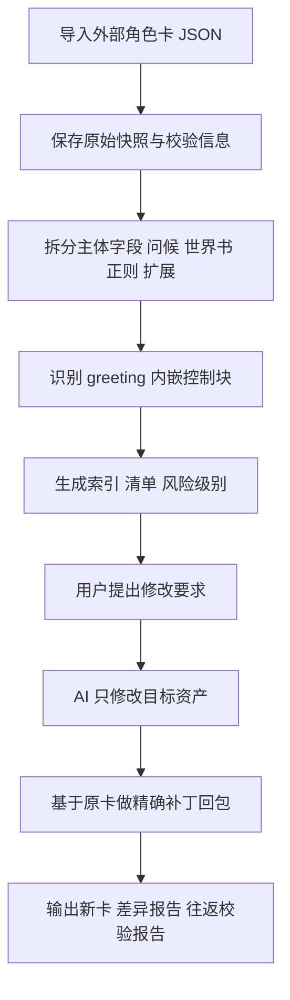

# 已打包角色卡升级方案 v2

> 状态：历史设计草案。本文记录的是外部 Tavern / 酒馆 v3 JSON 可逆编辑工具链的升级设想，不是当前已落地的执行规范。
>
> 当前实际范围以项目根 `AGENTS.md`、项目根 `README.md`、`tools/unpack-card.js`、`tools/repack-card.js` 和 `projects/<卡名>/unpacked/manifest.json` 为准：真实卡项目位于 `projects/<卡名>/`，已有卡拆包内容位于 `projects/<卡名>/unpacked/`，当前已落地的拆包资产包括 `greetings/`、`entries/`、`regex_scripts/`、`tavern_helper/`、`manifest.json` 与 `editable-summary.md`。本文中的 `output/edit-sessions/`、`manifest/`、`snippets/`、`regex-derived/`、`preserve/` 等结构仅代表未实施方案。

## 1. 目标

把当前项目从单向生卡工具，升级为支持外部 Tavern / 酒馆 v3 JSON 角色卡的可逆编辑工具链。

目标工作流：

1. 导入一张已经打包好的角色卡 JSON
2. 自动解包成可阅读、可修改的目录结构
3. 自动生成结构化说明，逐项记录各条目、各正则、各脚本、各表格、各问候文本的大概功能
4. 用户通过对话提出修改要求
5. AI 只改相关文件
6. 重新打包为新角色卡
7. 所有未修改内容必须完整保留，尤其是未知字段、外部扩展字段、脚本 ID、正则配置、扩展配置、数组结构形态

---

## 2. 基于外部样本的关键修正结论

这次加入真实外部样本后，原方案需要补充几个非常关键的兼容点。

外部样本显示，真实 Tavern v3 成品卡不只是：

- 顶层字段
- `data.character_book.entries`
- `data.extensions.regex_scripts`

还可能同时包含：

- 多段问候文本，例如 `first_mes` 与 `alternate_greetings`
- 问候文本内部嵌入自定义块，例如状态栏块、变量更新块、表格编辑块
- 多种类型的正则脚本，有的只是隐藏占位符，有的是状态栏 HTML 渲染器，有的是启动页或水印页
- 大型扩展对象，例如快速回复预设、系统提示词集合、脚本按钮配置
- 扩展字段既可能是对象，也可能是数组型键值结构
- 很长的系统提示词与脚本文本，这些内容必须保留原貌，不能因为格式化而破坏

因此，升级方案必须从 原先的 条目 + 正则 + 前端 + 表格 四类资产，扩展为：

- 卡主体字段
- 问候场景字段
- 文本内嵌控制块
- 世界书条目
- 正则脚本
- 正则派生 HTML
- 扩展配置对象
- 扩展脚本资产
- 未知保留资产

---

## 3. 外部样本兼容分析

以下分析只关注结构，不关注文本题材本身。

### 3.1 问候系统不是单一字段
外部样本说明，角色卡的开场内容至少分为两层：

- `first_mes`
- `alternate_greetings[]`

这意味着解包器不能只处理一个开场白文件，而要把所有问候场景都视为一类独立资产。

结论：

- 需要新增 `greetings/` 目录
- 每个 greeting 都要独立落盘
- 回包时必须保留原顺序、原数量
- 未修改的 greeting 必须原样透传

### 3.2 问候文本中可能嵌有结构化控制块
外部样本的问候文本内部出现了类似：

- `<state_bar>...</state_bar>`
- `<tableEdit>...</tableEdit>`
- `<UpdateVariable>...</UpdateVariable>`

这类块不是普通叙事文本，而是被外部扩展解释执行的控制片段。

结论：

- 不能把整段 greeting 只当纯文本处理
- 需要提供 可拆分视图 与 原文视图 双轨并存
- 这些块默认应视为 高风险资产
- 除非用户明确要改，否则应原样保留

### 3.3 正则脚本类型远比当前项目复杂
外部样本中的 `regex_scripts` 至少包含：

- 占位符隐藏脚本
- 结构块清理脚本
- 基于正则捕获组渲染状态栏的脚本
- 带大段 HTML / CSS / JS 的启动页或水印页脚本

这说明正则脚本不能仅按 当前项目的 欢迎页 / 状态栏 两种预设理解。

结论：

- 每个 regex script 必须先完整保存为原始 JSON
- 派生出的 HTML 只能作为可编辑镜像，不应直接替代原对象
- 回包时应优先补丁原脚本，而不是重建一个新脚本对象

### 3.4 扩展字段必须分级处理
外部样本中出现了大型扩展结构，例如：

- 快速回复相关配置对象
- 大段预设文本
- 扩展脚本清单
- 按键按钮可见性配置
- 数组形式的 `tavern_helper`

这类对象不适合在第一阶段全面语义化编辑。

结论：

- 扩展对象要分成三类：可安全编辑、谨慎编辑、仅透传保留
- 第一阶段必须优先保证这些结构可无损往返
- 对数组型扩展，必须保持原形态，不能擅自转成对象

### 3.5 世界书条目仍然可拆，但不能套用简化模板
外部样本的 `character_book.entries` 仍然是可拆的，但字段更完整、更依赖原始对象结构。

结论：

- 条目仍采用 一条一个文件
- 但必须保存完整对象
- 不允许再用简化模板覆盖原条目

---

## 4. 修正后的核心设计原则

### 原则 A：原卡优先
原始 JSON 是最高保真来源。回包必须基于原卡做定向补丁，而不是基于抽象模型全量重建。

### 原则 B：双轨表示
复杂资产同时保留：

- 原始视图
- 可编辑视图
- 指针映射

这样即使可编辑视图解析失败，也还能回退到原始视图保真回包。

### 原则 C：问候与脚本分离建模
`first_mes`、`alternate_greetings`、`regex_scripts`、扩展脚本都要视为独立资产，而不是附属文本。

### 原则 D：文本内嵌块不可粗暴重写
内嵌块采用 分段重建 模式，只重建明确变更过的片段，其他片段按原文保留。

### 原则 E：先无损，再智能
第一阶段优先实现外部卡 无修改往返不丢失；第二阶段才增强智能拆分和更细粒度编辑。

---

## 5. 修正后的工作流



---

## 6. 修正后的解包目录规范

建议统一工作目录：

```text
output/edit-sessions/<会话名>/
  source/
    original-card.json
    checksum.json
  manifest/
    manifest.yaml
    pointers.json
    asset-index.yaml
    preserve-map.json
  card/
    card-meta.yaml
    top-level.json
    data-core.json
  greetings/
    first-mes.md
    alternate/
      001.md
      002.md
    greeting-index.yaml
  snippets/
    first-mes/
      state-bar.xml
      table-edit.txt
      update-variable.txt
      segment-order.yaml
    alternate-001/
      state-bar.xml
      update-variable.txt
      segment-order.yaml
  entries/
    001-条目名.yaml
    002-条目名.yaml
  regex/
    001-script.json
    001-meta.yaml
    002-script.json
    002-meta.yaml
  regex-derived/
    001-replace.html
    003-replace.html
  extensions/
    depth-prompt.json
    quick-response-force.json
    tavern-helper.raw.json
    extension-index.yaml
  preserve/
    unknown-root.json
    unknown-data.json
    unknown-extensions.json
    untouched-script-fields/
  reports/
    inventory.md
    functional-summary.md
    change-log.yaml
    roundtrip-report.md
    risk-report.md
```

---

## 7. 资产分类规则

### 7.1 可安全编辑
默认可以给 AI 直接改：

- `card/card-meta.yaml` 中的普通文本字段
- `entries/*.yaml` 中的 `content`
- `greetings/*.md` 中的普通叙事文本
- 明确可识别且来源稳定的 HTML 镜像文件

### 7.2 需谨慎编辑
允许改，但必须带映射与重建规则：

- `greetings/*.md` 中混有控制块的文本
- `snippets/` 内的状态栏块、变量块、表格编辑块
- `regex/*.json` 里的 `findRegex`、`replaceString`
- `regex-derived/*.html`

### 7.3 仅透传保留
第一阶段默认不建议 AI 改动，除非用户明确指定：

- 大体积系统提示词
- 快速回复预设整体对象
- 扩展脚本导入 URL
- 按钮显隐配置
- 未识别扩展字段
- 数组型扩展结构

---

## 8. 各类内容的具体处理策略

### 8.1 卡主体字段
拆出常规字段：

- `name`
- `description`
- `personality`
- `scenario`
- `mes_example`
- `creator_notes`
- `system_prompt`
- `post_history_instructions`

处理方式：

- 主要编辑入口放在 `card/card-meta.yaml`
- 顶层与 `data` 镜像字段通过 `manifest` 记录同步关系
- 回包时按映射规则双向写回

### 8.2 问候字段
新增 greeting 资产层：

- `first_mes`
- `alternate_greetings[]`

处理方式：

- 每段问候文本独立落盘到 `greetings/`
- 对内部结构块做非破坏性扫描
- `greeting-index.yaml` 记录源路径、顺序、重建模式

### 8.3 文本内嵌控制块
针对 `<state_bar>`、`<tableEdit>`、`<UpdateVariable>` 这类片段：

- 提取独立文件到 `snippets/`
- 用 `segment-order.yaml` 记录文本片段与控制块片段的拼装顺序
- 原 greeting 文本可保留一份带占位标记的可编辑视图
- 回包时按片段顺序重建原文本

建议的片段类型：

- `plain-text`
- `state-bar`
- `table-edit`
- `update-variable`
- `unknown-block`

### 8.4 世界书条目
每条条目保存完整对象，至少包含：

- `id`
- `comment`
- `content`
- `keys`
- `secondary_keys`
- `constant`
- `enabled`
- `position`
- `insertion_order`
- `use_regex`
- `extensions`
- 任何额外未知字段

关键要求：

- 保留原顺序与原 `id`
- 只改 `content` 时其他字段不动
- 文件名只是显示友好层，不参与重建主键判断

### 8.5 正则脚本
每个正则脚本先完整保存到 `regex/*.json`，并生成一份 `regex/*.meta.yaml`。

元信息建议包括：

- 脚本名
- 原路径
- 识别类型
- 是否包含 HTML
- 是否包含 JS
- 是否包含 fenced 内容
- 是否可安全编辑
- 回包模式

建议的脚本类型：

- `hide-placeholder`
- `cleanup-block`
- `state-renderer`
- `html-launcher`
- `watermark-page`
- `unknown`

### 8.6 正则派生 HTML
如果 `replaceString` 中存在明确的 HTML 内容：

- 额外导出到 `regex-derived/*.html`
- 但它只作为镜像文件，不直接代表完整脚本
- `meta.yaml` 记录该 HTML 的包裹方式，例如 fenced markdown、纯 HTML、前后缀包装

### 8.7 扩展对象
对 `data.extensions` 下内容进行分级拆分：

#### 可拆对象
例如：

- `depth_prompt`
- 结构明确的小型对象

#### 谨慎对象
例如：

- `quick-response-force`

#### 原样保留对象
例如：

- `tavern_helper` 的数组型结构
- 无法稳定语义化的大型脚本集合

处理策略：

- 始终先保存原始 JSON
- 若提供可编辑视图，必须同时保留原始视图
- 回包时优先依据原始视图补丁

---

## 9. 修正后的保真回包策略

### 9.1 回包模式不再只有一种
建议支持以下几种回包模式：

- `passthrough`：完全透传
- `patch-scalar`：替换单个字段值
- `patch-object`：按对象层补丁
- `patch-array-item`：按数组索引补丁
- `patch-text-with-segments`：分段重建文本
- `derived-rebuild`：由镜像文件反推生成原字段

### 9.2 外部样本场景下的关键保障
必须确保以下内容默认不变：

- `alternate_greetings` 数组顺序与内容数量
- 所有 regex script 的 `id`
- 所有 regex script 的顺序
- `quick-response-force` 整体对象
- `tavern_helper` 的原始数组结构
- 扩展脚本按钮配置
- 未识别字段
- 大段系统提示词原文中的换行与缩进

### 9.3 回包建议流程
1. 读取 `source/original-card.json`
2. 读取 `manifest/asset-index.yaml`
3. 读取 `reports/change-log.yaml`
4. 只对已变更资产执行补丁
5. 对 greeting 文本执行分段重建
6. 对 regex 脚本优先做局部字段回填
7. 对 preserve 区完全透传
8. 输出新卡并生成校验报告

---

## 10. 结构化说明规范修正

新增一份更适合 AI 定向修改的说明格式。

### 10.1 `reports/inventory.md`
列清楚资产数量与分类：

- 主体字段
- 问候文本
- 内嵌控制块
- 世界书条目
- 正则脚本
- 正则派生 HTML
- 扩展对象
- 未识别保留项

### 10.2 `reports/functional-summary.md`
每项建议统一记录：

```yaml
- asset_id: greeting:first_mes
  source_pointer: /data/first_mes
  type: greeting
  summary: 主开场文本，内部包含状态栏与变量更新控制块
  editable_class: cautious
  editable_files:
    - greetings/first-mes.md
    - snippets/first-mes/state-bar.xml
    - snippets/first-mes/update-variable.txt
  repack_mode: patch-text-with-segments
  risk: medium
```

### 10.3 风险分级
建议分为：

- `low`：改动风险低
- `medium`：需要保持结构片段不变
- `high`：容易破坏外部扩展行为
- `preserve-only`：默认只保留，不建议自动改

---

## 11. 对现有项目实现顺序的修正

### 阶段 1：外部样本无损往返底座
先实现：

- 读取外部 Tavern v3 JSON
- 拆出主体字段、greetings、entries、regex、extensions
- 不做复杂语义化，只做映射与保留
- 确保无修改回包后结构不丢

这是最优先。

### 阶段 2：问候与内嵌控制块拆分
实现：

- `first_mes` 与 `alternate_greetings` 解包
- `<state_bar>`、`<tableEdit>`、`<UpdateVariable>` 识别与分段重建

### 阶段 3：正则脚本镜像能力
实现：

- regex 全对象保存
- HTML 派生镜像提取
- 局部补丁回包

### 阶段 4：世界书与主体文本编辑
实现：

- 条目内容修改
- 主体字段修改
- 结构化说明与变更账本联动

### 阶段 5：扩展对象谨慎编辑
最后才考虑：

- `quick-response-force` 的局部可编辑化
- `tavern_helper` 的更细粒度编辑能力

---

## 12. 具体实施拆分建议

建议后续切到代码实现时新增：

- `tools/lib/card-io.js`
- `tools/lib/json-pointer.js`
- `tools/lib/greeting-parser.js`
- `tools/lib/segment-rebuilder.js`
- `tools/lib/regex-extractor.js`
- `tools/lib/extension-classifier.js`
- `tools/lib/roundtrip-check.js`
- `tools/unpack-card.js`
- `tools/analyze-card.js`
- `tools/repack-card.js`

各自职责：

### `greeting-parser`
负责：

- 识别 `first_mes` 与 `alternate_greetings`
- 扫描并拆出内嵌控制块
- 输出分段顺序表

### `segment-rebuilder`
负责：

- 根据分段顺序把 greeting 与控制块重建回原字段

### `extension-classifier`
负责：

- 标记扩展字段属于 可编辑 / 谨慎 / 透传
- 检查对象型与数组型结构

### `roundtrip-check`
负责：

- 无修改往返比对
- 检查关键路径是否保留
- 检查数组顺序、脚本 ID、扩展形态是否一致

---

## 13. 修正后的验收标准

升级完成后，至少要满足以下结果：

### 基础往返
1. 能导入真实外部 Tavern v3 卡并解包
2. 无修改回包后，关键字段结构保持一致
3. 不丢失 `alternate_greetings`
4. 不丢失 regex script 的顺序和 `id`
5. 不丢失扩展对象与数组型结构

### 安全编辑
6. 能修改主体普通文本字段并成功回包
7. 能修改世界书条目 `content` 并成功回包
8. 能修改 greeting 中普通叙事文本，同时保留内嵌控制块

### 谨慎编辑
9. 能识别并导出控制块
10. 能在不破坏整体结构的前提下回填控制块
11. 能对单个 regex 脚本做局部修改，而不影响其他脚本

### 报告能力
12. 能生成资产清单
13. 能生成功能概述
14. 能生成风险等级与变更账本
15. 能生成 roundtrip 校验报告

---

## 14. 最终修订结论

加入真实外部样本后，最重要的变化是：

- 不能再把外部角色卡理解成 角色主体 + 世界书 + 正则 这么简单
- 问候文本本身就是一类复杂资产
- 文本内部还可能带控制块
- 扩展对象也可能包含高价值脚本和预设
- 很多对象第一阶段不该“理解后重建”，而该“映射后保留”

因此，推荐的最终路线是：

1. 保留当前 `tools/build-card.js` 作为本项目原生制卡工具
2. 新增外部卡编辑链路：解包、分析、回包
3. 第一阶段先完成真实外部卡的无损往返
4. 第二阶段再增强问候块、正则 HTML、扩展对象的可编辑能力
5. 全程采用 原卡快照 + 资产索引 + 保留映射 + 变更账本 的方案

这版方案比第一版更适合你真正要做的事：

先把成品卡拆开看清楚，再在不丢功能的前提下，按用户要求局部修改，最后可靠地还原成新的角色卡。